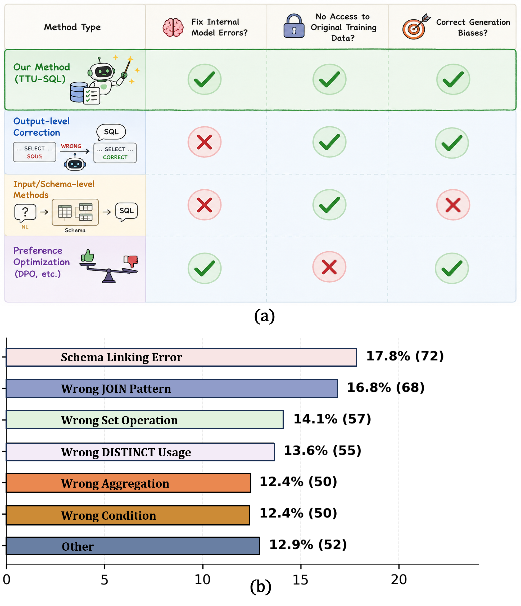
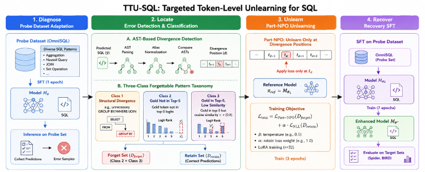

# TTU-SQL: Targeted Token-Level Unlearning for Repairing Text-to-SQL Models

<p align="center">
  <!-- TODO: replace the arXiv placeholders once the paper is on arXiv -->
  <a href="https://arxiv.org/abs/XXXX.XXXXX"></a>
  <a href="https://arxiv.org/abs/XXXX.XXXXX"></a>
  <a href="https://github.com/oakor/TTU-SQL"></a>
</p>

<p align="center">
  
</p>

<p align="center"><i>Motivation. (a) TTU-SQL vs. existing Text-to-SQL improvement paradigms. (b) Distribution of systematic error patterns on Spider Dev (DeepSeek-R1-Distill-Qwen-7B after OmniSQL SFT).</i></p>

## 📝 Summary

Text-to-SQL models may exhibit **recurring error generation patterns** that are reproducible under a fixed model and difficult to eliminate through continued training. **TTU-SQL** (*Targeted Token-level Unlearning for SQL*) is a machine-unlearning-based framework that detects and corrects these systematic errors **without access to the model's original training data**. It works directly at the parameter level rather than performing post-hoc output correction.

The framework has three components:

1. **AST-based token-level divergence detection** — precisely localizes the first erroneous decision point between a prediction and the gold SQL.
2. **Targeted error-type extraction** — selects three specific *forgettable* error types based on AST divergence and logit-level (top-5) behavior.
3. **Part-NPO** — applies Negative Preference Optimization **only to the localized divergence tokens**, suppressing erroneous continuations while preserving useful SQL-generation knowledge. This is followed by a recovery SFT.

Across **Spider** and **BIRD**, TTU-SQL yields consistent execution-accuracy gains over equal-budget Direct SFT across the evaluated backbones.

<p align="center">
  
</p>

<p align="center"><i>TTU-SQL framework: diagnose → locate → unlearn (Part-NPO) → recover.</i></p>

## 📁 Repository

| Directory | What's inside |
|-----------|---------------|
| [`make_data/`](make_data/) | Divergence detection & error classification: AST-based token-level divergence (`step1`), forget-data formatting (`step2`), alias restoration, `sqlglot`-based SQL parsing, and the 3-class error taxonomy with Llama-3.2-1B embeddings. |
| [`forget_token_level/npo/`](forget_token_level/npo/) | Part-NPO training: `train_npo.py` entry point, custom `NPOTrainer` (DPO-style forget loss + NLL retain loss with token-level `forget_mask`), data utilities, and forget/retain data conversion. |
| [`forget_token_level/npo_predict/`](forget_token_level/npo_predict/) | Inference (`predict_npo.py`) and execution-accuracy evaluation (`evaluate_exec_spider_omnisql.py`) for both Spider and OmniSQL formats. |
| [`forget_token_level/token_level_data_process/`](forget_token_level/token_level_data_process/) | Legacy character-level divergence script (older version of the `step1`+`step2` pipeline); kept for reference. |

## 📊 Datasets

TTU-SQL is evaluated on two public Text-to-SQL benchmarks. Download them and point the `--dataset_dir` / `--db_dir` config to your local copies.

| Dataset | Source |
|---------|--------|
| Spider | <https://yale-lily.github.io/spider> |
| BIRD | <https://bird-bench.github.io> |
| OmniSQL (SFT pipeline / data format) | <https://github.com/RUCKBReasoning/OmniSQL> |

## 🔧 Dependencies

- PyTorch, Transformers, PEFT (LoRA), DeepSpeed (optional)
- `sqlglot` (SQL parsing / AST)
- `jsonlines`, `tqdm`, `nltk`
- **Spider evaluation toolkit** (`process_sql.py`, `evaluation.py`) — used by `evaluate_exec_spider_omnisql.py`. It is **not vendored** in this repo; add it to your `PYTHONPATH` (the script expects it at `../../evaluation/spider-master`).

```bash
pip install torch transformers peft sqlglot jsonlines tqdm nltk
```

## 🚀 Typical Workflow

```
┌──────────────────────────────────────────────────────────────────┐
│  1. Divergence detection                                          │
│  make_data/src/step1_token_watch_divergence_simple.py             │
│    → generated_predictions_with_divergence.jsonl                 │
├──────────────────────────────────────────────────────────────────┤
│  2. Execution evaluation                                          │
│  forget_token_level/npo_predict/evaluate_exec_spider_omnisql.py   │
│    → generated_predictions_with_exec_unified.json                │
├──────────────────────────────────────────────────────────────────┤
│  3. Error classification (3 classes)                              │
│  make_data/test/contrast_concate.py                               │
│    → forget_class_1/2/3.json                                     │
├──────────────────────────────────────────────────────────────────┤
│  4. Format for NPO training                                       │
│  make_data/src/step2_generate_token_forget_data.py                │
│    → forget_format/forget_class_1/2/3.json                        │
├──────────────────────────────────────────────────────────────────┤
│  5. Part-NPO training                                            │
│  forget_token_level/npo/train_npo.py                              │
│    → npo_checkpoint/                                             │
├──────────────────────────────────────────────────────────────────┤
│  6. Inference & evaluation                                        │
│  forget_token_level/npo_predict/predict_npo.py                    │
│  forget_token_level/npo_predict/evaluate_exec_spider_omnisql.py   │
└──────────────────────────────────────────────────────────────────┘
```

Example commands (paths are illustrative — adjust to your layout):

```bash
# 1. Divergence detection
python make_data/src/step1_token_watch_divergence_simple.py \
    --model_name_or_path /path/to/sft_model \
    --dataset_dir /path/to/spider_data \
    --dataset spider_dev \
    --output_dir ./output \
    --per_device_eval_batch_size 8 \
    --max_new_tokens 1024

# 2. Execution evaluation
python forget_token_level/npo_predict/evaluate_exec_spider_omnisql.py \
    --pred_file ./output/predictions.jsonl \
    --test_file /path/to/spider_dev.json \
    --data_format omnisql

# 3. Error classification (edit the hardcoded paths at the top of the file)
python make_data/test/contrast_concate.py

# 5. Part-NPO training
python forget_token_level/npo/train_npo.py \
    --model_path /path/to/sft_model \
    --forget_data ./data/forget.json \
    --retain_data ./data/retain.json \
    --output_dir ./npo_output \
    --beta 0.1 --alpha 1.0 --gamma 1.0 \
    --use_lora --num_train_epochs 3 \
    --per_device_train_batch_size 2 --gradient_accumulation_steps 8 \
    --learning_rate 1e-5

# 6. Inference & evaluation
python forget_token_level/npo_predict/predict_npo.py \
    --model_path ./npo_output/merged_model \
    --data_path /path/to/test_data.json \
    --output_path ./predictions.jsonl \
    --data_format omnisql
python forget_token_level/npo_predict/evaluate_exec_spider_omnisql.py \
    --pred_file ./predictions.jsonl \
    --data_format omnisql
```

## 📐 Method & evaluation notes

- **Divergence localization** normalizes SQL by removing table aliases (so `T1.col` vs `a.col` don't count as divergence), then finds the first mismatching AST token and maps it back to the original prediction's whitespace-token position. The corresponding generation step is recovered via `tokenizer.decode` over the generated token IDs.
- For **DeepSeek-R1-Distill** models, `<think>...</think>` reasoning chains are stripped before comparison.
- **Execution accuracy** executes predicted vs. gold SQL against the SQLite databases and compares result sets (order-insensitive, `NULL`-safe sorting). See `evaluate_exec_spider_omnisql.py`.
- **Reproducibility.** Data-splitting scripts use a fixed seed (`seed=42`); inference uses greedy decoding (`do_sample=False`).
- **Evaluation transparency.** `evaluate_exec_spider_omnisql.py` applies a single uniform comparison to every sample — it executes the predicted and gold SQL against the SQLite database and compares result sets; there are **no per-query manual overrides**. Gold queries that error at execution are returned `exec_match = False` by `eval_exec_match` rather than crashing the evaluator.

## 📁 File reference

<details>
<summary><b>Detailed per-file description</b> (click to expand)</summary>

#### `make_data/src/step1_token_watch_divergence_simple.py`
Run inference on an OmniSQL SFT model, detect the first token-level divergence between prediction and gold, and record the top-5 logits at the divergence step. Restores SQL aliases, normalizes SQL, and maps subword generation steps back to whitespace-token positions. Outputs `generated_predictions_with_divergence.jsonl`.

#### `make_data/src/step2_generate_token_forget_data.py`
Convert divergence data into the NPO training format (`forget_tail`, `forget_mode`, ...). Reads `forget_class_1/2/3.json`, extracts the divergence suffix, and emits `First` (single token) / `Whole` (span) forget items.

#### `make_data/src/restore_aliases.py`
Extract alias mappings from `FROM ... alias` / `JOIN ... alias` and restore them in normalized SQL for fair comparison (e.g. `observations.object_name` → `o.object_name`).

#### `make_data/src/sqlparser.py`
SQL parsing/normalization built on `sqlglot`: normalize whitespace, parse to AST, extract a structural `QuerySignature` (tables, joins, filters, group_by, having, select, order_by, limit) with canonical table IDs, and locate the first divergent SQL stage.

#### `make_data/test/contrast_concate.py`
Classify divergence samples into three error classes:
- **Class 1** — the divergent suffix starts with a SQL keyword (`WHERE`, `JOIN`, `GROUP BY`, ...) → structural error.
- **Class 2** — none of the top-5 predicted tokens match the start of the gold suffix → the model is "confused".
- **Class 3** — a top-5 token matches the gold suffix but was not chosen, and Llama-3.2-1B embedding similarity `< 0.8` → the model is "uncertain".

#### `make_data/test/Llama3_Embedder.py`
Sentence embeddings via Llama-3.2-1B (mean-pooled last hidden state) with cosine similarity, used by `contrast_concate.py` for the Class-3 threshold.

#### `forget_token_level/npo/train_npo.py`
Part-NPO training entry point. Loads the SFT model + a frozen reference copy, builds forget-retain pairs, and optimizes `total_loss = gamma * forget_loss + alpha * retain_loss`. Supports LoRA and gradient checkpointing. Loads **two** model copies — ≥80 GB GPU memory recommended for 8B models.

#### `forget_token_level/npo/npo_trainer.py`
Custom `NPOTrainer(Trainer)`. Forget loss = DPO-style loss against the frozen reference (`-2/β · log σ(-β · log_ratio)`) with token-level `forget_mask`; retain loss = standard NLL. Includes debug logging of mask coverage.

#### `forget_token_level/npo/data_utils.py`
`QADataset`, `ForgetRetainDataset` (each forget paired with a randomly sampled retain), and `NPODataCollator` (tokenizes with the Llama-3 chat template, masks the prompt out of `labels`, and constructs `forget_mask`).

#### `forget_token_level/npo/convert_alpaca_to_npo.py`
Convert execution-evaluated predictions into NPO-ready forget/retain sets (`forget.json`, `retain.json`, `split_stats.json`).

#### `forget_token_level/npo_predict/predict_npo.py`
Generate SQL from a trained NPO checkpoint; supports OmniSQL (`question`/`answer`) and Spider (`instruction`/`input`/`output`) formats. Greedy decoding.

#### `forget_token_level/npo_predict/evaluate_exec_spider_omnisql.py`
Execute predicted vs. gold SQL against SQLite databases and compute execution accuracy. Loads the Spider schema/foreign-key toolkit, rebuilds SQL values/columns, and emits per-sample `exec_match`, `gold_sql`, `pred_result`, `gold_result`, plus an `*_exec_summary.txt`.

#### `forget_token_level/token_level_data_process/generate_token_forget_data.py`
Legacy character-level divergence script (older version of the `step1` + `step2` pipeline); kept for reference.

</details>

## 📚 Citation

If you find this work useful, please cite:

```bibtex
@inproceedings{zhang2026ttu,
  title     = {Targeted Token-Level Unlearning for Repairing Text-to-SQL Models},
  author    = {Zhang, Jinyu and Liu, Ruiheng and Zhang, Yu},
  booktitle = {Proceedings of the ...},   % TODO: fill in venue (e.g. EMNLP)
  year      = {2026}
}
```

## 🙏 Acknowledgements

TTU-SQL builds on [OmniSQL](https://github.com/RUCKBReasoning/OmniSQL) for SFT, the [Spider](https://yale-lily.github.io/spider) evaluation toolkit, and the [open-unlearning](https://github.com/licong-lin/open-unlearning) NPO implementation. Thanks to the authors of [Spider](https://yale-lily.github.io/spider) and [BIRD](https://bird-bench.github.io) for releasing the benchmarks used in this work.
